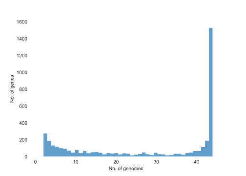
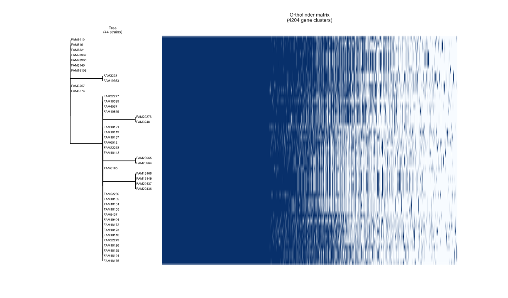
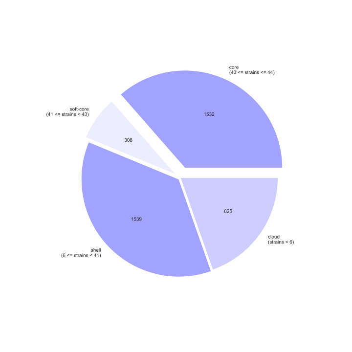

# OrthoFinder Tools

## Idea

* Calculate the most common gene name of each orthogroup by majority vote: `annotate_orthogroups`
* Create plots analogous to roary_plots: `orthofinder_plots`

## Setup

```shell
pip install orthofinder-tools
```

## Usage

### annotate_orthogroups

#### Prerequisites

Your FASTA sequences must have some description, e.g.:

```text
>gnl|extdb|STRAIN-XY_000001 DNA-directed RNA polymerase subunit beta' [Pediococcus stilesii]
MIDVNKFESMQIGLASPDKIRMWSYGEVKKPETINYRTLKPEKDGLFDERIFGPTKDYECACGKYKRIRY
...
```

From this protein, `DNA-directed RNA polymerase subunit beta'` will be extracted.

#### Command line usage

```
annotate_orthogroups --help

annotate_orthogroups \
    --orthogroups_tsv /path/to/N0_or_Orthogroups.tsv \
    --hog True \
    --fasta_dir /path/to/fastas \
    --file_endings faa \
    --out outfile.tsv \
    --simple True \
    --header True
```

If `--simple=False` resulting tsv looks like this:

|   HOG         |         Best Gene Name        | Gene Name Occurrences |
| ------------- | ----------------------------- | --------------------- |
| N0.HOG0000000 | amino acid ABC transporter    | {JSON}                |
| N0.HOG0000001 | IS30 family transposase       | {JSON}                |
| N0.HOG0000002 | IS5/IS1182 family transposase | {JSON}                |

The JSON is a dictionary with key='gene name' -> value=occurrence, for example:

```json5
{
  'Integrase core domain protein': 47,
  'hypothetical protein': 15,
  'IS30 family transposase': 126
}
```

If `--simple=True` resulting tsv looks like this (no header):

|               |                               |
|---------------|-------------------------------|
| N0.HOG0000000 | amino acid ABC transporter    |
| N0.HOG0000001 | IS30 family transposase       |
| N0.HOG0000002 | IS5/IS1182 family transposase |


#### Usage as python class

```python
# load class
from orthofinder_tools import OrthogroupToGeneName

PATH_TO_ORTHOFINDER_FASTAS = '/path/to/OrthoFinder/fastas'
CURRENT_FOLDER = 'Results_Mon00'

otg = OrthogroupToGeneName(
    fasta_dir=PATH_TO_ORTHOFINDER_FASTAS,
    file_endings='faa',
)
otg.load_hog(
    hog_tsv=F'{PATH_TO_ORTHOFINDER_FASTAS}/OrthoFinder/{CURRENT_FOLDER}/Phylogenetic_Hierarchical_Orthogroups/N0.tsv'
)
```

`otg.majority_dict` will be a python dict with key='orthogroup' -> value='best name', for example:

```json5
{
  'N0.HOG0000000': 'amino acid ABC transporter',
  'N0.HOG0000001': 'IS30 family transposase',
  'N0.HOG0000002': 'IS5/IS1182 family transposase',
}
```

`otg.save_majority_df(outfile='path/to/outfile.tsv)` writes the following file:

```text
HOG Best Gene Name  Gene Name Occurrences
N0.HOG0000000   amino acid ABC transporter Counter({'amino acid ABC transporter': 43})
...
```

`otg.save_orthogroup_to_gene_ids(outfile='path/to/outfile.tsv)` writes the following file (no header):

```text
N0.HOG0000000   gene_1  gene_2
N0.HOG0000001   gene_3  gene_4  gene_5
...
```

`otg.save_orthogroup_to_gene_ids(outfile='path/to/outfile.tsv)` writes the following file (no header):

```text
N0.HOG0000000	amino acid ABC transporter ATP-binding protein
N0.HOG0000001	ATP-binding cassette domain-containing protein
...
```

### orthofinder_plots

**Disclaimer:**
This script is a port of [roary_plots](https://github.com/sanger-pathogens/Roary/tree/master/contrib/roary_plots) by
Marco Galardini (marco@ebi.ac.uk).

```
# Command line usage:
orthofinder_plots --help
orthofinder_plots --tree data/SpeciesTree_rooted.txt --orthogroups_tsv data/Orthogroups.tsv --out output
```

Three files will be created:

<br>
<br>
<br>

#### Usage as python class

```python
# load class
from orthofinder_tools import create_plots

create_plots(
    tree='/path/to/SpeciesTree_rooted.txt',
    orthogroups_tsv='/path/to/Orthogroups.tsv',
    format='svg',
    no_labels=False,
    out='/path/to/output/folder'
)
```
